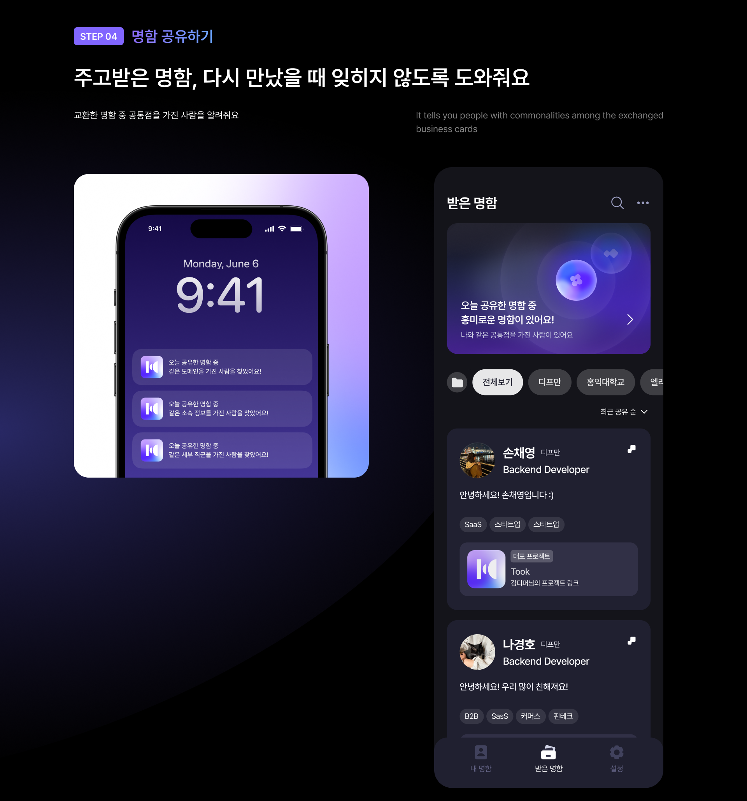

# 👉 Took 첫 만남의 순간 툭! 공유하는 디지털 명함 서비스

   

## 비즈니스적 정보는 간편하게, 사적 정보는 원하는 만큼만 공유해요 ✏️

내가 보여주고 싶은 정보만 담아 나를 소개하고, 첫 만남 이후에도 자연스럽게 연결될 수 있도록 도와주는 디지털 명함 서비스예요 🔗

## ✅ 주요 기능

### 1️⃣ 명함을 손쉽게 생성해요

SNS처럼 사적인 정보는 부담스럽고, 명함처럼 격식 있는 정보는 어색할 때

보여주고 싶은 정보만 골라 작성할 수 있어요.

### 2️⃣ QR로 손쉽게 공유해요

지류 명함은 그만, QR 또는 근처 탐색으로 간편하게 주고받을 수 있어요

### 3️⃣ 주변사람에게 버튼 한번으로 손쉽게 공유해요

위치를 기반으로 해 주변사람에게 내 명함을 손쉽게 공유할 수 있어요

### 4️⃣ 공유 후 리마인드 알림을 통해 다시 찾아봐요

오늘 공유받은 명함 중 나와 공통점이 있는 사람이 있다면,

잊지 않고 다시 연결될 수 있도록 알림을 보내줘요

이제 Took과 함께 네트워킹 자리에서 나를 더 다채롭고 손쉽게 소개하세요!

## 🛠 Tech Stack

## 📦 Installation

> 자세한 설치 방법은 [SETUP.md](SETUP)를 참고하세요.

## 🪪 License

> License 자세한 내용은 [LICENCE.md](LICENCE)를 참고하세요.

## 🎉 Contributors

<table>
  <tr>
    <td align="center">
      <a href="https://github.com/jangwonyoon">
        
         
        <b>jangwonyoon</b>
      </a>
    </td>
    <td align="center">
      <a href="https://github.com/JaeIn1">
        
         
        <b>JaeIn1</b>
      </a>
    </td>
    <td align="center">
      <a href="https://github.com/youngju6143">
        
         
        <b>youngju6143</b>
      </a>
    </td>
    <td align="center">
      <a href="https://github.com/semnil5202">
        
         
        <b>semnil5202</b>
      </a>
    </td>
  </tr>
</table>
